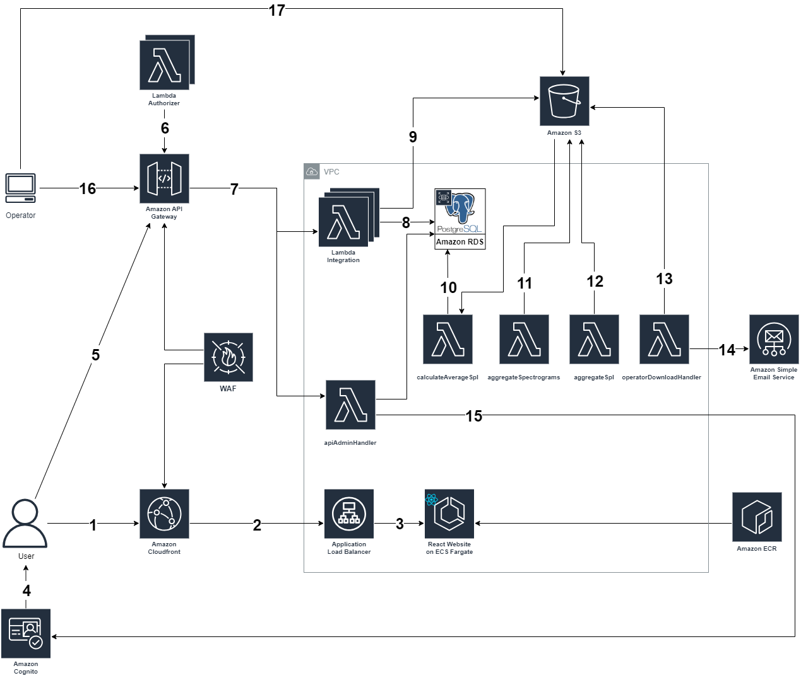

# NoiseTracker

The NoiseTracker prototype solution acts as a centralized information hub for hydrophone operators and members of the general public to learn more about the underwater soundscapes near them. The NoiseTracker interactive map allows users to view various noise metrics and metadata for each registered hydrophone. Through specialized interfaces, operators can view and download their hydrophones' settings, and administrators can modify the configuration settings for operators and their hydrophones. Also checkout the [NoiseTracker Client Software](https://github.com/UBC-CIC/noise-tracker-client) that allows hydrophone operators to connect with the system. For more information, please visit the [CIC Website](https://cic.ubc.ca/).

| Index                                               | Description                                             |
| :-------------------------------------------------- | :------------------------------------------------------ |
| [High Level Architecture](#high-level-architecture) | High level overview illustrating component interactions |
| [Deployment](#deployment-guide)                     | How to deploy the project                               |
| [User Guide](#user-guide)                           | The working solution                                    |
| [Directories](#directories)                          | General project directory structure
| [Changelog](#changelog)                             | Any changes post publish                                |
| [Credits](#credits)                                 | Meet the team behind the solution                       |
| [License](#license)                                 | License details                                         |

## High Level Architecture

The following architecture diagram illustrates the various AWS components utilized to deliver the solution. For an in-depth explanation of the frontend and backend stacks, refer to the [Architecture Deep Dive](docs/ArchitectureDeepDive.md).



## Deployment Guide

To deploy this solution, please follow the steps laid out in the [Deployment Guide](docs/DeploymentGuide.md)

## User Guide

For instructions on how to navigate the web app interface, refer to the [Web App User Guide](docs/UserGuide.md).

## Directories

```
├── backend
│   └── cdk
│       ├── bin
│       ├── lambda
│       └── lib
├── docs
└── frontend
    ├── public
    └── src
        ├── components
        ├── pages
```

1. `/backend/cdk`: Contains the deployment code for the app's AWS infrastructure
    - `/bin`: Contains the instantiation of CDK stack
    - `/lib`: Contains the deployment code for all infrastructure stacks
    - `/lambda`: Contains lambda functions
2. `/docs`: Contains documentation for the application
3. `/frontend`: Contains the user interface of the application
    - `/src/components`: Contains components used in the application
    - `/src/pages`: Contains pages comprising the application's interface

## Changelog
N/A

## Credits

This application was architected and developed by Liam Driscoll and Arshia Moghimi, with project assistance from Franklin Ma. A special thanks to the UBC Cloud Innovation Centre Technical and Project Management teams for their guidance and support.

## License

This project is distributed under the [MIT License](LICENSE).

Licenses of libraries and tools used by the system are listed below:

[MIT License](LICENSE)

Used Material UI library to design user interface
