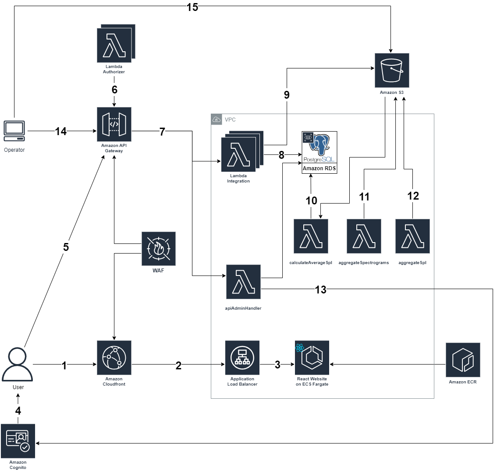

# Architecture Deep Dive

## Architecture

## Description
### Web Application
1. The user sends a request to a Cloudfront Distribution with caching enabled. If there is a cache hit, CloudFront returns the cached data. The Web Application Firewall (WAF) will ensure that general security protection is enforced. Further explanation of what is being protected can be found in the CDK stack.
2. On a cache miss, Cloudfront will send a request to an Application Load Balancer (ALB).
3. The ALB checks the health status of the container. If the status is healthy, it forwards the request to the container which runs on Elastic Container Service (ECS). The ECS loads an image file that contains the web app from a repository in the Elastic Container Registry (ECR). The image file is used to run on a container as an ECS task using Fargate, a serverless compute engine for containers. If a task fails, the ECS Service will redeploy a new task.
4. When an admin or operator user logs in to the web app, the web app will forward the authentication to Cognito. Upon successful authentication, a token (JSON Web Token (JWT)) is returned.
5. The web app then makes requests to various endpoints on the API Gateway. 
6. Each request is passed with the JWT token that will trigger a Lambda Authorizer to check if the user is in an authorized user group (admin or operator). 

### Cloud Backend
7. Upon successful authentication, the API Gateway will forward the request to one of the lambda integrations.
8. For requests related to RDS, the lambda integration will make a PostgreSQL (PSQL) call to RDS using Postgres and return the data accordingly.
9. For requests related to S3, the lambda integration will request to get objects from S3 and return data accordingly.
10. Once a day, the average monthly spl values are calculated using data from S3 and are stored in the database.
11. Once a day, the 1-minute interval spectrograms are combined into a single daily spectrogram which is stored in S3.
12. Each hour, the 1-minute interval spl data is combined into hourly spl values which are stored in S3.  
13. When an admin creates a new operator using the admin dashboard, a new user is created in the Cognito user pool.

### Client Software
14. Client software fetched the hydrophone details and configurations by calling an API endpoint. This endpoint invokes a lambda function (7) that fetches the details from the Noise Tracker Database (8).
15. The client application also needs to upload the analysis results into the cloud, which is done by uploading JSON files in the Noise Tracker S3 Bucket.

