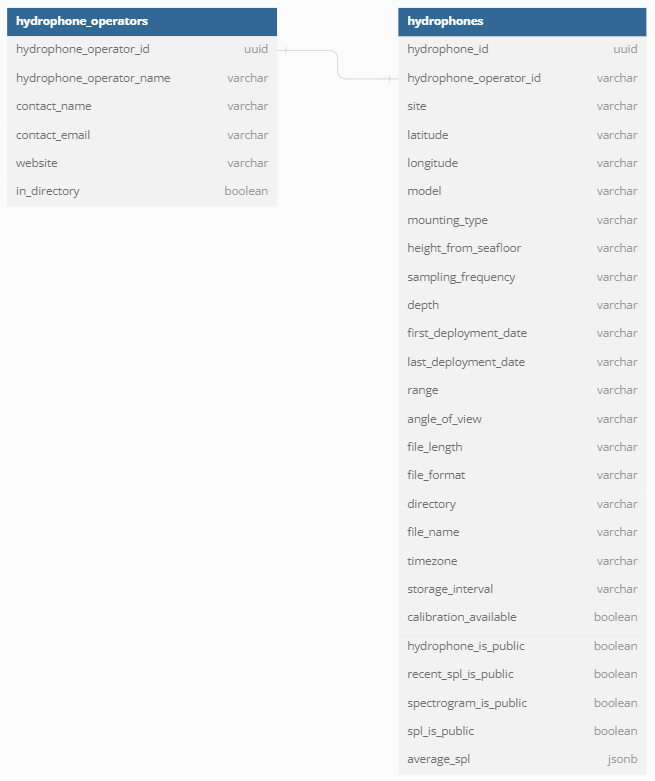

# Architecture Deep Dive

## Architecture


## Description
### Web Application
1. The user sends a request to a Cloudfront Distribution with caching enabled. If there is a cache hit, CloudFront returns the cached data. The Web Application Firewall (WAF) will ensure that general security protection is enforced. Further explanation of what is being protected can be found in the CDK stack.
2. On a cache miss, Cloudfront will send a request to an Application Load Balancer (ALB).
3. The ALB checks the health status of the container. If the status is healthy, it forwards the request to the container which runs on Elastic Container Service (ECS). The ECS loads an image file that contains the web app from a repository in the Elastic Container Registry (ECR). The image file is used to run on a container as an ECS task using Fargate, a serverless compute engine for containers. If a task fails, the ECS Service will redeploy a new task.
4. When an admin or operator user logs in to the web app, the web app will forward the authentication to Cognito. Upon successful authentication, a token (JSON Web Token (JWT)) is returned.
5. The web app then makes requests to various endpoints on the API Gateway. 
6. Each request is passed with the JWT token that will trigger a Lambda Authorizer to check if the user is in an authorized user group (admin or operator). 

### Cloud Backend
7. Upon successful authentication, the API Gateway will forward the request to one of the lambda integrations.
8. For requests related to RDS, the lambda integration will make a PostgreSQL (PSQL) call to RDS using Postgres and return the data accordingly.
9. For requests related to S3, the lambda integration will request to get objects from S3 and return data accordingly.
10. Once a day, the average monthly spl values are calculated using data from S3 and are stored in the database.
11. Once a day, the 1-minute interval spectrograms are combined into a single daily spectrogram which is stored in S3.
12. Each hour, the 1-minute interval spl data is combined into hourly spl values which are stored in S3.  
13. Objects in S3 are filtered based on user inputted parameters. The filtered objects are than combined into a single zip file which gets stored in S3. 
14. An email is sent to the user who requested the download. The email contains a pre-signed URL that the user can use to download the zip file from S3.
15. When an admin creates a new operator using the admin dashboard, a new user is created in the Cognito user pool.

### Client Software
16. Client software fetched the hydrophone details and configurations by calling an API endpoint. This endpoint invokes a lambda function (7) that fetches the details from the Noise Tracker Database (8).
17. The client application also needs to upload the analysis results into the cloud, which is done by uploading JSON files in the Noise Tracker S3 Bucket.

## Database Schema



### `hydrophone_operators` table

| Column Name | Description 
| ----------- | ----------- 
| hydrophone_operator_id | The uuid of the hydrophone operator
| hydrophone_operator_name | The name of the hydrophone operator's organization
| contact_name | The name of the organization contact 
| contact_email | The email address of the organization contact
| website | The organization's website
| in_directory | Whether or not the organization is opted into sharing their contact information in the operator directory


### `hydrophones` table

| Column Name | Description 
| ----------- | ----------- 
| hydrophone_id | The uuid of the hydrophone
| hydrophone_operator_id |  The uuid of the hydrophone's associated hydrophone operator
| site | The name of the hydrophone site
| latitude | The latitude of the hydrophone
| longitude | The longitude of the hydrophone
| model | The model of the hydrophone
| mounting_type | The mounting type of the hydrophone
| height_from_seafloor | The height of the hydrophone above the seafloor in meters
| sampling_frequency | The sampling frequency of the hydrophone in kilohertz
| depth | The depth of the hydrophone in meters
| first_deployment_date | The date that the hydrophone was first deployed
| last_deployment_date | The date that the hydrophone was most recently deployed
| range | The range of the hydrophone in meters
| angle_of_view | The hydrophone's angle of view in degrees
| file_length | The length of audio files in minutes 
| file_format | The format of the audio file
| directory | The directory that the audio files are stored in on the hydrophone operator's system 
| file_name | The format of file names 
| timezone | The timezone of the hydrophone
| storage_interval | How often files are stored
| calibration_available | Whether or not calibration data is available for the hydrophone 
| hydrophone_is_public | Whether or not all hydrophone data is public (visible on map page)
| recent_spl_is_public | Whether or not recent spl metric (gauge charts) is public (visible on map page)
| spectrogram_is_public | Whether or not spectrograms are public (visible on map page)
| spl_is_public | Whether or not spl graph is public (visible on map page)
| average_spl | Average monthly sound pressure level values, calculated daily

## S3 Structure

```
.
├── hydrophone/
│   ├── spl/
│   │   └── year/
│   │       └── month/
│   │           └── day/
│   │               └── timestamp.json
│   ├── biospl/
│   │   └── year/
│   │       └── month/
│   │           └── day/
│   │               └── timestamp.json
│   ├── spectrogram/
│   │   └── year/
│   │       └── month/
│   │           └── day/
│   │               └── timestamp.png
│   └── calibration.csv
└── download/
    └── NoiseTrackerDownload_##########.zip
```


1. `hydrophone_id/`: Contains objects associated with the hydrophone
    - `spl/`: Contains objects with individual frequency spl data
        - `year/`: Contains objects with data that is from a certain year
            - `month/`: Contains objects with data from a certain month
                - `day/`: Contains objects with data from a certain day
                    - `timestamp.json`: Contains individual frequency spl data for a 60 second period
    - `biospl/`: Contains all of the objects containing banded spl data (e.g., a band could be 10-100Hz)
        - `year/`: Contains objects with data that is from a certain year
            - `month/`: Contains objects with data from a certain month
                - `day/`: Contains objects with data from a certain day
                    - `timestamp.json`: Contains banded frequency spl data for a 60 second period
    - `spectrogram/`: Contains all of the images containing 60 second spectrograms
        - `year/`: Contains objects with data that is from a certain year
            - `month/`: Contains objects with data from a certain month
                - `day/`: Contains objects with data from a certain day
                    - `timestamp.png`: Contains spectrograms for a 60 second period
    - `calibration.csv`: Contains calibration data for the hydrophone

2. `/download`: Contains all of the zip objects generated by operators, objects with the "download/" prefix are automatically deleted after 1 day
    - `/NoiseTrackerDownload_##########.zip`: Contains objects that a user requested to download

### Sample Objects
#### Sample `/spl` Object Key
`08b591c4-4c5c-4faf-97f0-02aacd48246b/spl/2024/04/29/2024-04-29-00-01-22.json`
- [Sample spl File](sample_data/sample_spl_data.json)

#### Sample `/biospl` Object Key
`08b591c4-4c5c-4faf-97f0-02aacd48246b/biospl/2024/04/29/2024-04-29-00-01-32.json` 
- [Sample biospl File](sample_data/sample_biospl_data.json)

#### Sample `/spectrogram` Object Key
`08b591c4-4c5c-4faf-97f0-02aacd48246b/spectrogram/2024/04/29/2024-04-29-00-01-40.png`
- [Sample spectrogram File](sample_data/sample_spectrogram_data.png)