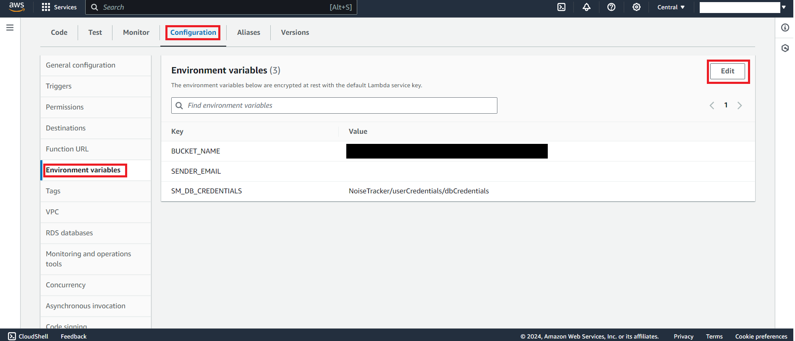

# Deployment walkthrough

## Table of Contents

- [Requirements](#requirements)
- [Step 1: Clone The Repository](#step-1-clone-the-repository)
- [Step 2: Cloud Deployment](#step-2-cloud-deployment)
    - [Step 1: Install Dependencies](#step-1-install-dependencies)
    - [Step 2: Upload Database Secrets](#step-2-upload-database-secrets)
    - [Step 3: CDK Deployment](#step-3-cdk-deployment)
        - [1. Create Elastic Container Registry (ECR)](#1-create-elastic-container-registry-ecr)
        - [2. Create and Push Docker Image to ECR](#2-create-and-push-docker-image-to-ecr)
        - [3. Deploy all stacks](#3-deploy-all-stacks)
        - [Extra: Finding important values](#extra-finding-important-values)
        - [Extra: Taking down the deployed stacks](#extra-taking-down-the-deployed-stacks)
- [Step 3: Set Up Email Sending](#step-3-set-up-email-sending)
- [Step 4: Request Production Access in SES](#step-4-request-production-access-in-ses)


## Requirements

Before you deploy, you must have the following installed on your device:

- [git](https://git-scm.com/downloads)
- [AWS Account](https://aws.amazon.com/account/)
- [GitHub Account](https://github.com/)
- [AWS CLI](https://aws.amazon.com/cli/)
- [AWS CDK](https://docs.aws.amazon.com/cdk/latest/guide/cli.html)
- [Docker](https://www.docker.com/products/docker-desktop/)
- [Node.js and npm](https://docs.npmjs.com/downloading-and-installing-node-js-and-npm)

If you are on a Windows device, it is recommended to install the [Windows Subsystem For Linux](https://docs.microsoft.com/en-us/windows/wsl/install), which lets you run a Linux terminal on your Windows computer natively. Some of the steps will require its use. [Windows Terminal](https://apps.microsoft.com/store/detail/windows-terminal/9N0DX20HK701) is also recommended for using WSL.

## Step 1: Clone The Repository

First, clone the GitHub repository onto your machine. To do this:

1. Create a folder on your computer to contain the project code.
2. For an Apple computer, open Terminal. If on a Windows machine, open Command Prompt or Windows Terminal. Enter into the folder you made using the command `cd path/to/folder`. To find the path to a folder on a Mac, right-click on the folder and press `Get Info`, then select the whole text found under `Where:` and copy with ⌘C. On Windows (not WSL), enter the folder on File Explorer and click on the path box (located to the left of the search bar), then copy the whole text that shows up.
3. Clone the GitHub repository by entering the following:

```bash
git clone https://github.com/UBC-CIC/noise-tracker-web.git
```

The code should now be in the folder you created. Navigate into the root folder containing the entire codebase by running the command:

```bash
cd noise-tracker-web
```

## Step 2: Cloud Deployment

It's time to set up everything that goes on behind the scenes and host it! For more information on how the backend works, feel free to refer to the [Architecture Deep Dive](./ArchitectureDeepDive.md), but an understanding of the backend is not necessary for deployment.

### Step 1: Install Dependencies

The first step is to get into the backend folder. Assuming you are currently still in the root directory (`noise-tracker-web/`), navigate to `noise-tracker-web/backend` using:

```bash
cd backend
```

Now that you are in the backend directory, install the core dependencies with the following command:

```bash
npm install
```

### Step 2: Upload Database Secrets

You would have to supply a custom database username when deploying the solution to increase security. Run the following command and ensure you replace YOUR-DB-USERNAME with the custom name of your choice.

```bash
aws secretsmanager create-secret \
    --name NoiseTrackerSecrets \
    --secret-string "{\"DB_Username\":\"<YOUR-DB-USERNAME>\"}"\
    --profile <your-profile-name>
```

For example,

```bash
aws secretsmanager create-secret \
    --name NoiseTrackerSecrets \
    --secret-string "{\"DB_Username\":\"NoiseTracker\"}"\
    --profile <your-profile-name>
```

### Step 3: CDK Deployment

Initialize the CDK stacks (required only if you have not deployed this stack before). Note this CDK deployment was tested in `ca-central-1` region only.

```bash
cdk synth --profile <aws-profile-name>
cdk bootstrap --profile <aws-profile-name>
```

For CDK deployment, we are going to do the following:

1. [Create Elastic Container Registry (ECR)](#1-create-elastic-container-registry-ecr)
2. [Create a Docker image and push it to ECR](#2-create-and-push-docker-image-to-ecr)
3. [Deploy all stacks](#3-deploy-all-stacks)

Most of the commands assume you are in `noise-tracker-web/backend/` directory unless the instruction says to change the directory.

#### 1. Create Elastic Container Registry (ECR)

This will create a repository called `noise-tracker-repo`.

Note: The default platform intended for the container is --platform=linux/amd64. Might be able to run on MacOS. For Windows, you probably have to get rid of the flag inside the Dockerfile before building.

Run the following command to create an ECR repository.

```bash
cdk deploy ECRStack --profile <aws-profile-name>
```

#### 2. Create and Push Docker Image to ECR

Once a repository is created, we can create and push Docker images. 

Assuming you are currently still in the `noise-tracker-web/backend/` directory, navigate to the root directory (`noise-tracker-web/`) using:

```bash
cd ..
```

1. Go to ECR in AWS Console
2. Look for `noise-tracker-repo` repository
3. Click on `View push commands` and follow the instructions\*
4. Make sure you have Docker daemon running

This is a sample of the `View push commands`:


\*Note: in Step 1 of the instructions, you can specify which profile to use by specifying in the following:

```bash
aws ecr get-login-password --region ca-central-1 --profile <aws-profile-name> | docker login --username AWS --password-stdin <link-to-ecr>
```

#### 3. Deploy all stacks

This step will create the following CloudFormation stacks:

- `Cloudfront-WAFWebACL` - creates a CLOUDFRONT Web ACL in `us-east-1` region
- `VpcStack` - creates a VPC
- `FunctionalityStack` - creates fuctional services like Cognito, S3, Cloudfront distribution
- `DBStack` - creates RDS database
- `DBFlowStack` - loads existing data to database
- `APIStack` - creates an API Gateway and Lambdas that attach with each endpoints
- `DataWorkflowStack` - creates functions to process data
- `HostStack` - launches the admin page to ECS fronted by CloudFront (for local deployment, you can skip this step)

Navigate to the `/noise-tracker-web/backend/` directory. This deployment will take time. If your login session is short, you can always deploy one stack at a time in the order above.

The deployment command for the `hostStack` requires a parameter calls `prefixListID` which is used for ALB security group. This value can be obtained from the table below, based on the region that the `hostStack` deploys to.

| Region Code    | PL Code     |
| -------------- | ----------- |
| ap-northeast-1 | pl-58a04531 |
| ap-northeast-2 | pl-22a6434b |
| ap-south-1     | pl-9aa247f3 |
| ap-southeast-1 | pl-31a34658 |
| ap-southeast-2 | pl-b8a742d1 |
| ca-central-1   | pl-38a64351 |
| eu-central-1   | pl-a3a144ca |
| eu-north-1     | pl-fab65393 |
| eu-west-1      | pl-4fa04526 |
| eu-west-2      | pl-93a247fa |
| eu-west-3      | pl-75b1541c |
| sa-east-1      | pl-5da64334 |
| us-east-1      | pl-3b927c52 |
| us-east-2      | pl-b6a144df |
| us-west-1      | pl-4ea04527 |
| us-west-2      | pl-82a045eb |

Then, use the following command below and pass in the `prefixListID` value.

```bash
cdk deploy --all \
  --parameters HostStack:prefixListID=<your-region-preFixListId> \
  --profile <aws-profile-name>
```

For example, the `prefixListID` for `ca-central-1` is `pl-38a64351`, so we have the following command:

```bash
cdk deploy --all \
  --parameters HostStack:prefixListID=pl-38a64351 \
  --profile <aws-profile-name>
```

If you have trouble running the above command, try removing all the `\` and run it in one line.

### Extra: Finding important values

After deployment is completed, look for the following in the terminal:

- `Hosted Website URL` - this is the hosted URL which can be accessed through a browser

### Extra: Taking down the deployed stacks

To take down the deployed stack for a fresh redeployment in the future, navigate to AWS Cloudformation, click on the stack(s), and hit Delete. If any stack fails to delete, this is because deletion protection has been enabled for the resource. If you want to delete the resource, click on the resource in Events and disable deletion protection.

Please wait for the stacks in each step to be properly deleted before deleting the stack downstream.

Also make sure to delete secrets in Secrets Manager and a stack in `us-east-1`.

## Step 3: Set Up Email Sending
### 1. Verify Email Address
In order to send emails to users that contain links that they use to download data, we must set up and verify an email address to send emails **from**.

First, to verify the email address, go to the SES console and select `Get set up` on the sidebar. Please ensure the region displayed in the top right of the screen is the region in which you have deployed the project.


Scroll down to the `Get production access and start sending emails` section and click on `Create identity` button in the `Verify email address` box.


Select the option `email address`, and enter your email of choice in the box labeled `email address`. Your screen should appear like the image below. Click **create identity** to finish.

 

Navigate to your email inbox, you should have received an email from Amazon Web Services, click on the blue link to verify your email address.


The link should take you to a page that confirms your email has been verified, no further action is required on that page.

### 2. Configure Lambda Environment Variable
Then, navigate to the Lambda console, once again, ensure the region shown at the top right of the screen is the region in which your app is deployed. Click on the sidebar tab labeled `Functions`, then use the search bar to search for a function named **'noiseTracker-operatorDownloadHandler'**. We will configure this Lambda function to use your verified email address with the following steps.


Click on the function name to open it and navigate to the tab labeled `Configuration`. Then, in the sidebar on the left, select the tab `Environment variables` and click on the button `Edit`.



In the page that opens, for the `Value` of the `Key` labelled `SENDER_EMAIL`, type in the email address that was verified in the steps above. Click save to save your changes.


If at anytime you wish to change the email address, repeat this section with the new email address.

## Step 4: Request Production Access in SES

By default, AWS will limit your access to SES services to prevent spam and unrestricting spending, as each email has an associated cost. For this project, we will want to gain production access in order to be able to send a download link to any user that requests to download data. 

**Note: Without production access, emails can only be sent to verified email addresses. To test the email functionality without production access, you can verify the receiving email addresses by following the [steps above](#1-verify-email-address).**

Begin by navigating to the SES Console and ensure the region indicated in the top right is the region in which the app is deployed. Select the `Get set up` button on the sidebar. Then, select the button labeled `Request Production Access`.


On the subsequent page, take the following action:

1. Check the box labeled `Transactional`

2. For website URL, enter the `Hosted Website URL` from the earlier [deployment](#extra-finding-important-values). This URL can be found in the Cloudfront console.

3. `Use case description` should explain how the application plans to use Amazon SES to send email. The following text is a sample description of how the application plans to use Amazon SES. 
```
This web application is a centralized information hub for hydrophone operators and members of the general public to learn more about the underwater soundscapes near them. Only hydrophone operators, who are in contact with the application admins, will receive emails. Users are able to request to download data from S3 and they will receive an email containing a pre-signed download URL that they can use to download the requested data.

One type of email will be sent through the application:
    Download URL -> this sends an email containing a pre-signed download URL that the user can use to download the requested data.

Assuming the rate of 25 users/month, an estimated maximum of 2 emails will be sent per day

An invalid email address will result in no email being sent

Recipients are only sent emails at their own request.
```
4. In the box `Additional contacts`, add any emails you may wish to receive notifications on the status of this request for production access.

5. Finally, check the box for terms and conditions, and click the button `Submit request`

## Viewing Support Cases

After submitting the requests for production access, the status of these requests can be viewed at the AWS Support Console. Ensure the region on the top right is the region in which the app is deployed. Go to the section `Your support cases` to view your support cases.
