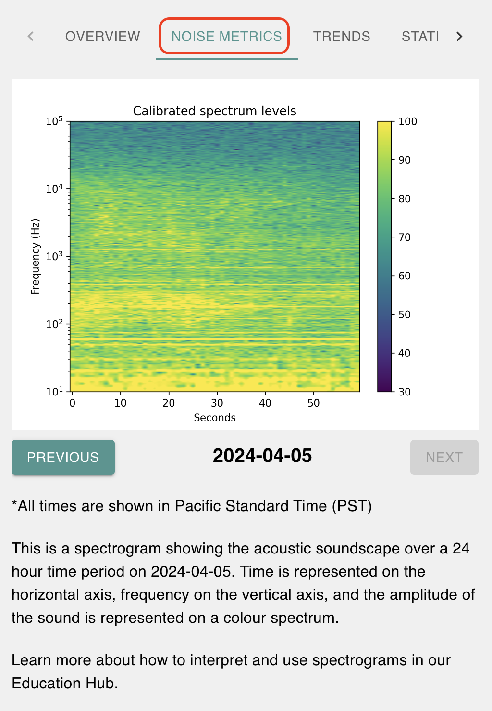
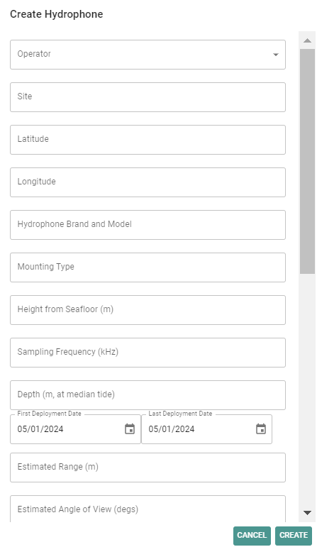

# User Guide

**Before Continuing with this User Guide, please make sure you have deployed the frontend and backend stacks.**

- [Deployment Guide](./DeploymentGuide.md)

Once you have deployed the solution, the following user guide will help you navigate the functions available.

| Index                                       | Description                                         |
| :------------------------------------------ | :-------------------------------------------------- | 
| [Login](#login)                             | Creating an Admin user and logging in               |
| [Hydrophone Tabs](#hydrophone-tabs)         | Description of available hydrophone information     |
| [Operator Profile](#operator-profile)       | Walkthrough of the Operator view and functionaliies |
| [Admin Dashboard](#admin-dashboard)       | Walkthrough of the Admin view and functionalities   |

## Login

If you have already logged in, you can continue to [Hydrophone Tabs](#hydrophone-tabs). Otherwise, the following section will walkthrough creating an Admin user and logging in to the Admin page.

In the AWS Console:

1. Search for Amazon Cognito in the search bar and click on it.
   

2. Select the `noiseTrackerUserPool` user pool
   

3. Next, we will create a user. Under Users, click on `Create user`.
   

4. Under User information:

   - Select `Send an email invitation`
   - Input the user's username. This is what will be used to login to the app.
   - Input the user's email address and mark as verified
   - Select `Generate a password`
   - Click `Create user`
     
     

5. Next, we will add this user to the `ADMIN_USER` group. Click into the newly added user, then under Group memberships, click on `Add user to a group`
   

6. Select the `ADMIN_USER` group then click `Add`
   

Great! Now you can login with the newly created admin user. Check your email for the temporary password to sign in. 
    

Upon sign in, you will be asked to change your password.

## Hydrophone Tabs

The interactive map page is the default page after logging in.

This map displays a clickable icon for each hydrophone in the database. Once clicked, information about the hydrophone and its metrics are available through the following tabs:

- [**Overview**](#overview) - plots for decibel level broadband and specific frequency bands
- [**Noise Metrics**](#noise-metrics)- interactive spectrogram and Sound Pressure Level diagrams
- [**Trends**](#trends) - placeholder for future trend data
- [**Station Information**](#station-information) - description of hydrophone metadata

### Overview

Users can view the latest broadband dB level and latest dB levels in specific frequency bands overlaid on monthly averages through a gauge chart.

### Noise Metrics

Users can view spectrograms showing the acoustic soundscape over the past 24 hours. Previous data up to a week into the past is also available. Time is represented on the horizontal axis, frequency on the vertical axis, and the amplitude of the sound is represented on a colour spectrum. 

Sound Pressure Levels in specific frequency bands over the last 24 hours are also viewable.

### Trends

This tab is a placeholder for the future development longer-term noise trends.

### Station Information

Users can view hydrophone metadata; these include the hydrophone's:
- Site
- Location (in coordinates)
- Brand and Model
- Mounting Type (bottom-mount, surface buoy, etc.)
- Height from seafloor (m)
- Sampling frequency (kHz)
- Depth (m, at median tide)
- First Deployed Date
- Most Recently Deployed Date
- Calibration Status
- Estimated range (m)
- Estimated angle of view (degrees)

## Operator Profile

Hydrophone operators have access to an Operator Profile, from which they can view the following tabs:
- [**Information**](#information) - metadata for all associated hydrophones
- [**Download**](#download) - downloadable metrics
- [**Directory**](#directory) - contact information of other operators

### Information

This tab displays a list of all the operator's registered hydrophones and their associated metadata. For ease of use, clicking on the "Show Details" button next to a hydrophone will bring the operator back to the interactive map with that hydrophone selected.

### Download

This tab lists which hydrophone data the operator would like to download. The date range may also be selected, and a ZIP file will be exported and link to download the file will be sent to the user in an email.

### Directory

This tab lists the hydrophones and contact information of all other operators. This directory may be referred to for data requests or other collaborative purposes.

## Admin Dashboard

Administrators have access to an Admin Dashboard, from which they can interact with the database by adding new operators and hydrophones, or by configuring their settings.

### Adding a new operator

A new operator can be created by clicking the "Create Operator" button and inputting the operator's organization, organization website, contact name, and contact email. The contact email will be used as the operator's username for logging in. An email containing a temporary password will be sent to the operator's contact email. Upon logging in, the operator will be asked to change their password.

### Editing an operator

An operator's information can also be modified by clicking on the "Edit" icon. After making the changes, click the "Save" button to confirm.

### Adding a new hydrophone

A new hydrophone can be created by clicking the "Create Hydrophone" button and inputting the following information:
- Operator
- Site
- Latitude
- Longitude
- Brand and Model
- Mounting Type (bottom-mount, surface buoy, etc.)
- Height from seafloor (m)
- Sampling frequency (kHz)
- Depth (m, at median tide)
- First Deployed Date
- Last Deployed Date
- Estimated range (m)
- Estimated angle of view (degrees)
- File length (mins)
- File format
- Directory
- Sample file name
- Timezone
- Storage interval (daily, monthly, etc.)
- Calibration information (if available)
- Hydrophone privacy (visibility of hydrophone on map)
- Recent SPL privacy (visibillity of gauge charts) 
- Spectrogram privacy (visiblity of spectrograms)
- SPL privacy (visibility of SPL graph)  

### Editing a hydrophone

A hydrophone's metadata can also be modified by clicking on the "Edit" icon. New calibration files may also be uploaded here. After making the changes, click the "Save" button to confirm.

### Deleting operators or hydrophones

To delete an operator or hydrophone, click the "Delete" icon at the end of each entry.

